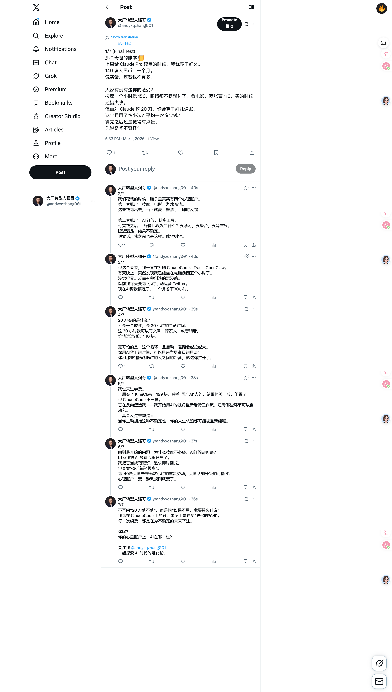
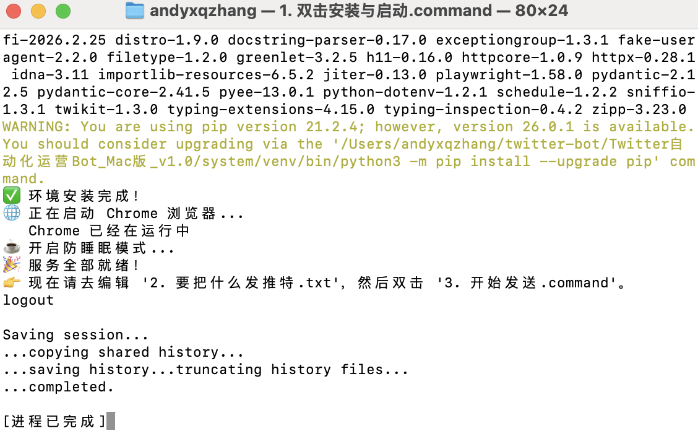

# Twitter Auto-Bot (Mac版) 🤖

> **文科生也能用的全自动 Twitter 运营助理 | 0代码 | 模拟真人 | 防封号**

 
*(这里请放一张头图，或者删掉这行)*

## ✨ 核心亮点

*   **零门槛**：无需 API，无需写代码，双击即用。
*   **超安全**：基于本地 Chrome 浏览器，模拟真人打字和点击，完全符合 Twitter 规则。
*   **全自动**：支持长推文 (Thread) 自动拆分发送。
*   **防封号**：内置随机延迟和防指纹检测机制。

## 📸 效果演示

*(请把您运行成功的截图命名为 demo.png 放在 assets 文件夹里)*

## 🚀 快速开始

1.  **下载**：点击右上角 `Code` -> `Download ZIP`。
2.  **解压**：解压到桌面。
3.  **运行**：
    *   双击 `1. 双击安装与启动.command` 初始化环境。
    *   双击 `2. 修改发帖内容.txt` 填入你的推文。
    *   双击 `3. 双击开始发送.command` 开始全自动发帖。

## ⚠️ 注意事项

*   **系统要求**：macOS 10.15+
*   **浏览器**：必须安装 Google Chrome
*   **操作禁忌**：脚本运行时**请勿操作鼠标和键盘**，否则会导致发送失败。

## 👨‍💻 作者

**强哥 (@andyxqzhang001)**
*   专注 AI 落地实战
*   帮文科生入局赚钱，帮 AI 产品实现增长

[关注我的 Twitter](https://twitter.com/andyxqzhang001) 获取更多 AI 搞钱干货。

---
*本项目仅供学习交流，请勿用于发送垃圾信息。*
